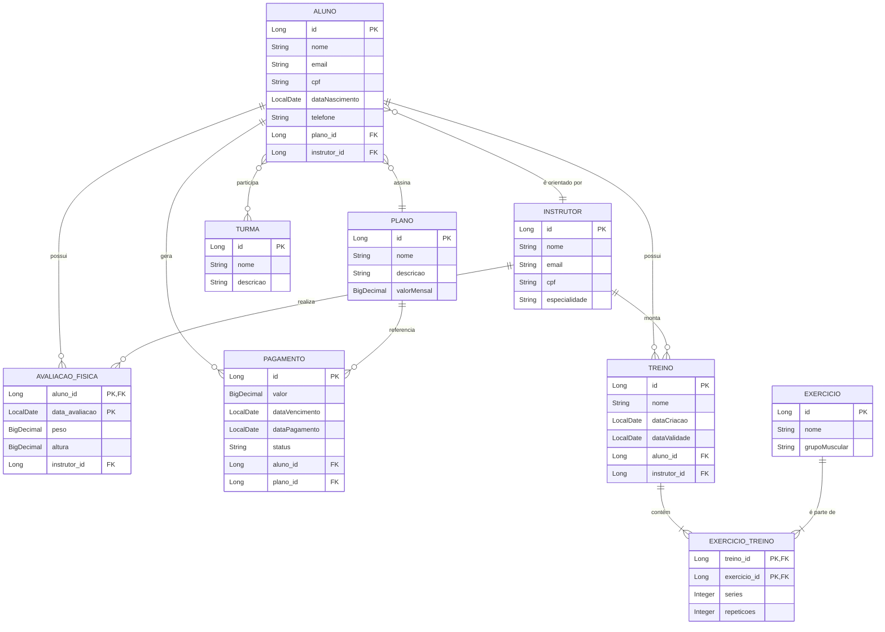

## Sistema de Gestão de Academia (Academia Manager)

## Observação

O presente projeto foi criado durante o segundo semestre de 2025, no Quarto Semestre do curso de **Análise e Desenvolvimento de Sistemas** no **Centro Universitário SENAC Santo Amaro**, durante a matéria de **Desenvolvimento Web**.

## 1. Descrição do Domínio e Justificativa das Entidades
   O domínio escolhido modela a gestão completa de uma academia, cobrindo processos essenciais como matrícula, controle de frequência, avaliação física e faturamento. A complexidade do domínio garante a aplicação de todos os requisitos de modelagem e operações avançadas exigidos no trabalho.
   
O projeto as seguintes classes de domínio principais: Aula, Aluno, Instrutor, Plano, Pagamento, AvaliacaoFisica, Turma, Treino, ExercicioTreino e Exercicio. Além disso, foram criadas as entidades AvaliacaoFisicaID e ExercicioTreinoID para gerenciar as chaves compostas e a junção de entidades.

## 2. Diagrama Conceitual (ERD)



## 3. Relações e Estruturas Obrigatórias Implementadas
Todas as estruturas exigidas foram implementadas e mapeadas no Spring Data JPA:

Relação Um-para-Muitos (1:N): Implementada entre Plano e Pagamento.

Relação Muitos-para-Um (N:1): Implementada entre Aluno e Plano.

Relação Muitos-para-Muitos (N:N): Implementada entre Aluno e Turma, utilizando uma tabela de junção implícita (aluno_turma).

Chave Primária Simples: Utilizada nas entidades Aluno, Instrutor, Plano, Treino, Turma e Exercicio.

Chave Primária Composta: Utilizada na entidade AvaliacaoFisica, combinando o ID do Aluno e a data da avaliação (@EmbeddedId).

Chave Estrangeira como Chave Primária: Utilizada na entidade ExercicioTreino, onde o ID do Treino e o ID do Exercício compõem a chave primária via @MapsId.

## 4. Operações de Negócio e Lógicas Além do CRUD
Foram implementadas as seguintes operações avançadas nas camadas Service e Repository:

Processos Compostos ou Transacionais: O método TreinoService.criarTreinoComExercicios() executa a criação de um Treino e de todos os seus ExercicioTreinos em uma única transação (@Transactional). Isso garante que a integridade do treino seja preservada.

Cálculo e Agregação: O método PagamentoService.calcularTotalRecebidoPeriodo() utiliza a função SQL SUM() para agregar a receita total de pagamentos com status 'PAGO' em um período específico, fornecendo um resumo financeiro.

Consultas com Múltiplos Critérios e Filtros Compostos: O PagamentoRepository possui uma consulta que busca pagamentos que atendam a múltiplos critérios: status = 'PENDENTE', dataVencimento < CURRENT_DATE (atrasado) E que pertençam a um Plano específico.

Respostas Agregadas ou Combinadas: O TreinoRepository utiliza JOINs complexos para retornar uma lista de Treinos (entidade principal) filtrada por um atributo de uma entidade aninhada (Exercicio), como buscar treinos que contenham o exercício 'Supino'.

## 5. Exemplos de Uso e Chamadas de API (Endpoints Chave)
A aplicação é executada na porta 8080.

A. Criar Treino Transacional (Processo Composto)
Endpoint: POST /api/treinos/com-exercicios

Descrição: Testa a atomicidade da transação ao criar o Treino (ID 501) e seus itens de exercício de uma só vez, usando os dados do data.sql.

Exemplo de JSON de Requisição:

```mermaid
JSON

{
"nome": "Treino Exemplo Final",
"dataCriacao": "2025-11-09",
"dataValidade": "2026-03-01",
"tipo": "MUSCULACAO",
"ativo": true,
"aluno": { "id": 201 },
"instrutor": { "id": 101 },
"exercicios": [
{
"series": 4, "repeticoes": 10, "cargaEstimada": 90.0,
"exercicio": { "id": 401 }
}
]
}
```

B. Consulta com Agregação (Cálculo)
Endpoint: 
```mermaid
GET /api/pagamentos/total-recebido
```

Parâmetros: inicio, fim (no formato YYYY-MM-DD).

Exemplo de Chamada: 

```mermaid
GET /api/pagamentos/total-recebido?inicio=2025-10-01&fim=2025-11-30
```

C. Consulta Combinada (Filtro por Junção)
Endpoint: 

```mermaid
GET /api/treinos/buscar-por-exercicio
```

Parâmetro: nome (parte do nome do exercício).

Exemplo de Chamada: 

```mermaid
GET /api/treinos/buscar-por-exercicio?nome=Supino
```

## 6. Instruções de Execução
Configuração do Banco: Garanta que o arquivo src/main/resources/application.properties contenha as seguintes linhas para que o data.sql seja executado após a criação das tabelas:

```mermaid
Properties

spring.jpa.hibernate.ddl-auto=create-drop
spring.jpa.defer-datasource-initialization=true
```

Dados Iniciais: O arquivo src/main/resources/data.sql será executado automaticamente na inicialização para popular todas as tabelas (Planos, Alunos, Instrutores, etc.) com IDs fixos para garantir a integridade referencial.

Execução: Compile e execute a aplicação (ex: mvn spring-boot:run).

Teste: Utilize o H2 Console ou ferramentas como Postman/Insomnia para testar os endpoints acima.